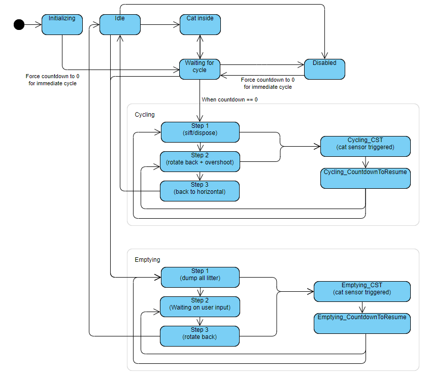
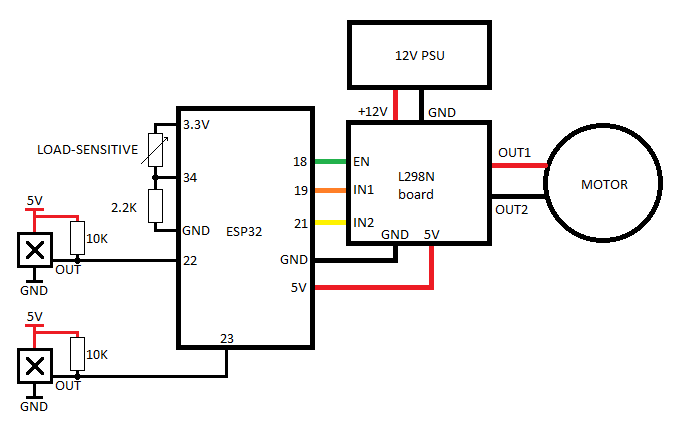

## LitterEater
### An alternative motherboard for the Litter Robot 3

*Never ask an engineer to clean the litterbox* - my wife :')

---

This repository contains all data needed to make a working alternative motherboard for the Litter Robot 3.

## Code
There's only the LitterEater.ino file, really. It's a bit huge, admittedly, but I tried to keep it cleaned and split in separate blocks.

You'll need to set your Arduino IDE up for ESP32 programming, as well as the following libraries :
 * AsyncTCP
 * ESPAsyncWebServer
 * AsyncElegantOTA
 * WiFiConnect Lite

You'll also need to install the ESP32 Filesystem Uploader, [instructions here](https://randomnerdtutorials.com/install-esp32-filesystem-uploader-arduino-ide/).

## How it works

The core of the code is a state machine that can execute code on every loop while in a state, as well as once during transitions. The full state diagram is as follows :

## Electronics

The full electronics are pretty simple, actually :
 * An ESP32 is at the heart of it
 * The motor is driven through a L298N H-bridge. I'm using [this one](https://www.amazon.fr/gp/product/B07YXFQ8CZ) because it also supplies 5V to power the ESP32.
 * A simple voltage divider is made using the load sensitive resistor and a 2.2KOhm resistor. The resulting voltage goes in a pin for `analogRead` to pick up.
 * The two Hall sensors are wired up the most simple way. +5V in, pullup resistor, result goes in a digital input pin.

My best rendition of a schematic with MS Paint :

---

So... One sorry day of December, 2021, my Litter Robot 3 started acting weird.

First, it gave me a fast-flashing blue light, switching to slow yellow when pressing Reset. Then it started to freeze at bootup on a solid yellow light - no amount of cleaning or making sure the connectors were all secure helped. Nor did sanding the pinch detector, either.

Unfortunately, at that moment, it was just out of warranty, so my only option was to buy a new motherboard, and those things are expensive.

It turns out, the Litter Robot 3 is made of pretty simple electronics. Hell, the "CPU" on there is a PIC 16F microcontroller. There had to be a way to get all this to work again.

So, here's how this fail-safe (/s) machine works :
 * The biggest part of it is a 12V motor + reducting gear set that rotates the drum back and forth
 * The drum contains tiny neodymium magnets, triggering hall sensors that act as end stop switches
 * The "cat sensor" is a simple load-sensitive resistor
 * The pinch detector is a basic mechanical switch made of two metal pieces
 * The most complex part apart from the motherboard is the DFI sensor, which I haven't reimplemented yet but shouldn't be too much of an issue.

The parts most prone to fail in there are the motherboard and the DFI sensors, which in my opinion look *way* over-engineered. 

*Cue a side-look to an ESP32 board lying on my desk...*

With all that in mind, I settled to making my own alternative motherboard out of an ESP32. Since I'm not going to be using the stock motherboard's form factor, using the original button placements is out of the way.

All parts included, I was able to make my own for around $15. When I make a final PCB instead of the prototyping board I used it shouldn't exceed $20.

I decided to ditch buttons altogether instead, switching to a fully remote control.

No more beating around the bush, here's [the GitHub repository to the whole thing](https://github.com/xtrium-lnx/litter-eater).

The repo contains the complete electronic schematics, full source code (using the Arduino IDE) with (some) documentation about how I implemented this... thing.

Here are the features it currently has :
 * Over-the-air updating for when I screw around with code / when more features come along
 * Capture portal to connect it to your home Wifi
 * Full control over the timings, from the delay before sifting to overshooting endstops (either to make litter horizontal again or to help with dumping)
 * Makes your fried Litter Robot eat cat poop again :')

What's left to do :
 * Pinch detection
 * Drawer full detection
 * (Maybe) Cat detection depending on weight
 * Push notifications when your cats go in or when the drawer's full

**tl;dr:** Litter Robot 3 motherboard fried, decided to make my own instead. Was lots of fun *and* way cheaper, 10/10 would do it again.
