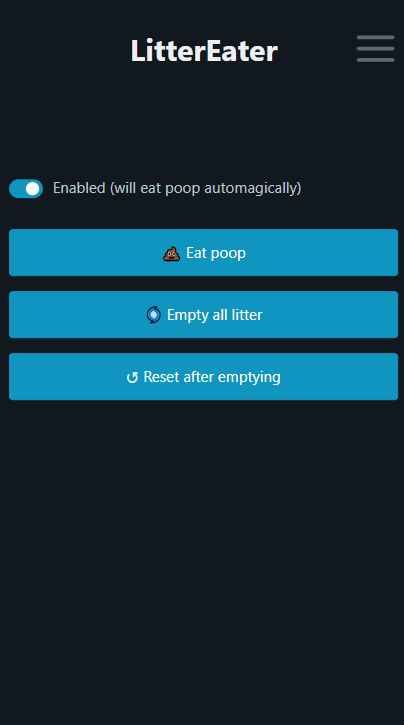
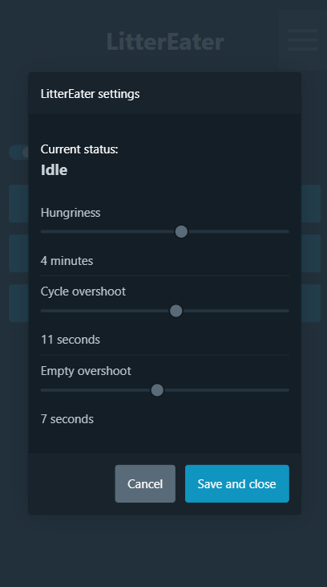

## LitterEater
### An alternative motherboard for the Litter Robot 3

*Never ask an engineer to clean the litterbox* - my wife :')

---

This repository contains all data needed to make a working alternative motherboard for the Litter Robot 3.

## Code
There's only the LitterEater.ino file, really. It's a bit huge, admittedly, but I tried to keep it cleaned and split in separate blocks.

You'll need to set your Arduino IDE up for ESP32 programming, as well as the following libraries :
 * AsyncTCP
 * ESPAsyncWebServer
 * AsyncElegantOTA
 * WiFiConnect Lite

You'll also need to install the ESP32 Filesystem Uploader, [instructions here](https://randomnerdtutorials.com/install-esp32-filesystem-uploader-arduino-ide/).

## How it works

The core of the code is a state machine that can execute code on every loop while in a state, as well as once during transitions. The full state diagram is as follows :


## Electronics

The full electronics are pretty simple, actually :
 * An ESP32 is at the heart of it
 * The motor is driven through a L298N H-bridge. I'm using [this one](https://www.amazon.fr/gp/product/B07YXFQ8CZ) because it also supplies 5V to power the ESP32.
 * A simple voltage divider is made using the load sensitive resistor and a 2.2KOhm resistor. The resulting voltage goes in a pin for `analogRead` to pick up.
 * The two Hall sensors are wired up the most simple way. +5V in, pullup resistor, result goes in a digital input pin.

My best rendition of a schematic with MS Paint :


## What's working, what's not

Working :
 * Over-the-air updating for when I screw around with code / when more features come along
 * Capture portal to connect it to your home Wifi
 * Full control over the timings, from the delay before sifting to overshooting endstops (either to make litter horizontal again or to help with dumping)
 * Makes your fried Litter Robot eat cat poop again :')

To do:
 * Pinch detection
 * Drawer full detection
 * (Maybe) Cat detection depending on weight
 * Push notifications when your cats go in or when the drawer's full

## The web app

It uses jquery and pico.css, but no worries, they're provided through their respective CDNs.

### Home screen


 * The "enabled" switch allows to manually allow/block the drum from turning. Code-wise, it puts the state machine to a Disabled mode that can't go to WaitingForCycle, basically blocking the state machine until it's switched on again (triggers a cycle when switched back on)

 * "Eat poop" starts a cycle (essentially what does the Cycle button)
 * "Empty all litter" rotates the drum backwards to dump all litter, then stops upside down
 * "Reset after emptying" rotates the drum back to be in the right position to fill it up again.

### Settings


 * "Current status" : Essentially, the state the FSM is in. Replaces the front-panel LEDs with more detail.
 * Hungriness : how fast the LitterEater eats poop. (delay between a cat going in and a cycle starting)
 * Cycle overshoot : Now that one's tricky. The magnet at the bottom of the drum is placed so that the drum's perfectly upwards when it triggers. To level the clean litter, we need to overshoot this magnet slightly - this control allows to choose how much we want. I found 10-12 seconds to be a good value.
 * Empty overshoot : Same thing, but upside-down. Litter dumps best with a slight overshoot.

## Licensing

This project is licensed under the WTFPL v2 :

```
           DO WHAT THE FUCK YOU WANT TO PUBLIC LICENSE
                   Version 2, December 2004

Copyright (C) 2004 Sam Hocevar <sam@hocevar.net>

Everyone is permitted to copy and distribute verbatim or modified
copies of this license document, and changing it is allowed as long
as the name is changed.

           DO WHAT THE FUCK YOU WANT TO PUBLIC LICENSE
  TERMS AND CONDITIONS FOR COPYING, DISTRIBUTION AND MODIFICATION

 0. You just DO WHAT THE FUCK YOU WANT TO.
```
